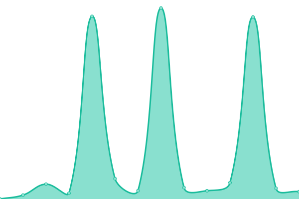
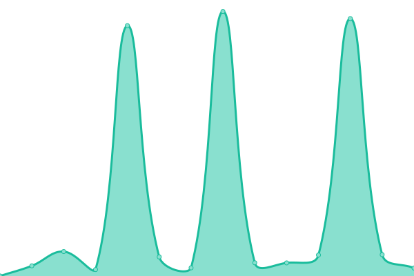

# [📈 Live Status](https://mvwicky.github.io/holdmyuptime): <!--live status--> **🟩 All systems operational**

This repository contains the open-source uptime monitor and status page for [Michael Van Wickle](wherewasigoing.com), powered by [Upptime](https://github.com/upptime/upptime).

With [Upptime](https://upptime.js.org), you can get your own unlimited and free uptime monitor and status page, powered entirely by a GitHub repository. We use [Issues](https://github.com/mvwicky/holdmyuptime/issues) as incident reports, [Actions](https://github.com/mvwicky/holdmyuptime/actions) as uptime monitors, and [Pages](https://mvwicky.github.io/holdmyuptime) for the status page.

<!--start: status pages-->
<!-- This summary is generated by Upptime (https://github.com/upptime/upptime) -->
<!-- Do not edit this manually, your changes will be overwritten -->
<!-- prettier-ignore -->
| URL | Status | History | Response Time | Uptime |
| --- | ------ | ------- | ------------- | ------ |
|  [Hold My Pics](https://holdmypics.com/) | 🟩 Up | [hold-my-pics.yml](https://github.com/mvwicky/holdmyuptime/commits/HEAD/history/hold-my-pics.yml) | 

 237ms
     
 | 

<a href="https://mvwicky.github.io/holdmyuptime/history/hold-my-pics">100.00%</a>
    

|  [Where Was I Going With That?](https://www.wherewasigoing.com/) | 🟩 Up | [where-was-i-going-with-that.yml](https://github.com/mvwicky/holdmyuptime/commits/HEAD/history/where-was-i-going-with-that.yml) | 

 240ms
     
 | 

<a href="https://mvwicky.github.io/holdmyuptime/history/where-was-i-going-with-that">100.00%</a>
    

|  [Crunchy Arcane Riddles](https://crunchy-arcane-riddles.com/) | 🟩 Up | [crunchy-arcane-riddles.yml](https://github.com/mvwicky/holdmyuptime/commits/HEAD/history/crunchy-arcane-riddles.yml) | 

 247ms
     
 | 

<a href="https://mvwicky.github.io/holdmyuptime/history/crunchy-arcane-riddles">100.00%</a>
    

<!--end: status pages-->

[**Visit our status website →**](https://mvwicky.github.io/holdmyuptime)

## 📄 License

- Powered by: [Upptime](https://github.com/upptime/upptime)
- Code: [MIT](./LICENSE) © [Michael Van Wickle](wherewasigoing.com)
- Data in the `./history` directory: [Open Database License](https://opendatacommons.org/licenses/odbl/1-0/)
